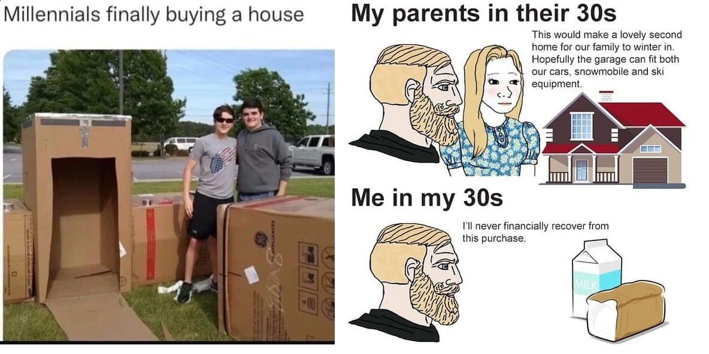

# Webscraping Housing

I have been seeing memes about how it is becoming more difficult to buy houses compared to past decades, this is a phenomenon in several countries, so I started researching the topic, and part of this research is creating a predictive model for house prices. , for this I will apply a linear regression.

He estado viendo memes sobre como cada vez es mas dificil comprar casas en comparacion con decadas pasadas, esto es un fenomeno de varios paises, así que comence a investigar sobre el tema, y parte de esta investigacion es crear un modelo predictivo de precios de casas, para esto aplicare una regresion lineal.

The project is divided into several parts and this part consists only of capturing information from the network about houses for sale in the state of Queretaro, this information will have to be cleaned, analyzed and prepared to train a machine learning model later.

Note: In the AI Academy of which I was part, a similar project was carried out as a team, but on that occasion we obtained the information from kaggle. Now the use of libraries such as Selenium and Beautiful Soup is being considered to capture information.

* [Team proyect from AI Academy](https://github.com/hixtape1212/Group1Capstone)

El proyecto se divide en varias partes y esta parte consiste solo en captura informacion de la red sobre casas en venta en el estado de Queretaro, esta informacion tendra que ser limpiada, analizada y preparada para entrenar un modelo de machine learning posteriormente.

Nota: En la AI Academy de la cual fui parte, se realizo un proyecto similar en equipo, pero en esa ocasion obtuvimos la informacion de kaggle. Ahora se plantea el uso de librerias como Selenium y Beautiful Soup para capturar informacion.
aplicare una regresion lineal.

* [Proyecto en equipo de AI Academy](https://github.com/hixtape1212/Group1Capstone)